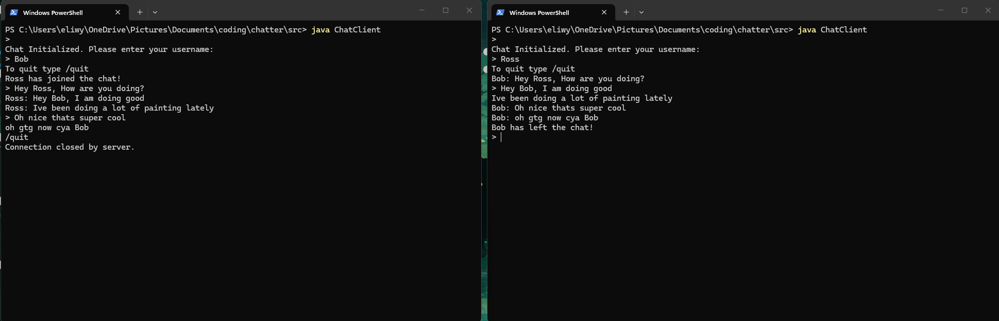

# Chatter
 
A terminal-based chat server built in Java. Multiple clients can connect and message each other in real time over a local network.
 
---
 
## How it works
 
The server listens on port 5000 and spawns a new thread for each client that connects. A shared `ChatRoom` object holds references to all connected clients and handles broadcasting messages between them. Each client runs two threads — one for reading incoming messages from the server, one for sending keyboard input.
 
```
Client A  ──┐
             ├──▶  Server  ──▶  ChatRoom  ──▶  broadcasts to all other clients
Client B  ──┘
```
 
---
 
## Project structure
 
```
chatter/
├── src/
│   ├── Server.java          # Entry point, accepts connections and spawns threads
│   ├── ChatRoom.java        # Manages connected clients and broadcasts messages
│   ├── ClientHandler.java   # Handles a single client connection (runs on its own thread)
│   └── ChatClient.java      # Client-side app with separate read/write threads
└── test/
    └── ChatRoomTest.java    # JUnit tests for broadcast and client management logic (unfinished)
```
 
---
 
## Getting started
 
**Requirements**
- JDK 21
- A terminal that supports `\r` carriage returns (most do)
 
**Run the server**
```bash
javac src/*.java
java -cp src Server
```
You should see:
```
Server is running on port 5000...
```
 
**Connect a client** (open a new terminal for each one)
```bash
java -cp src ChatClient
```
You will be prompted to enter a username. Open two or three terminals and connect multiple clients to start chatting.
 
**Quit**
```
/quit
```
 
---
## Demo



 
## Design notes
 
**Thread safety** — `ChatRoom` uses a `CopyOnWriteArrayList` to store connected clients. Since multiple threads call `addClient`, `removeClient`, and `broadcast` concurrently, a regular `ArrayList` would not be safe here. `CopyOnWriteArrayList` handles concurrent reads and writes without needing manual synchronization.
 
**One thread per client** — each `ClientHandler` runs on its own thread, which keeps the server simple and means one slow or stuck client does not block others.
 
**Two threads per client** — `ChatClient` runs a reading thread and a writing thread in parallel. Both reading from the server and reading keyboard input are blocking operations, so they need to run independently or one would block the other.
 
**Terminal flicker fix** — incoming messages use `\r` to clear the current input line before printing, which stops messages from printing on top of whatever the user is currently typing.
 
---
 
## Built With

- Java 21
- JUnit 5